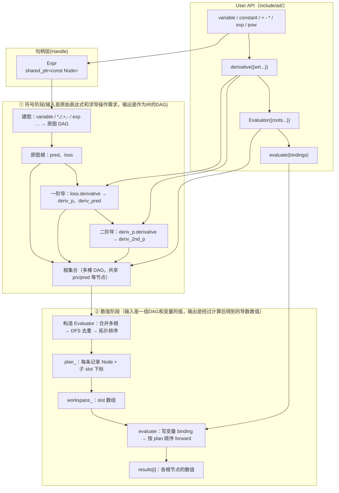
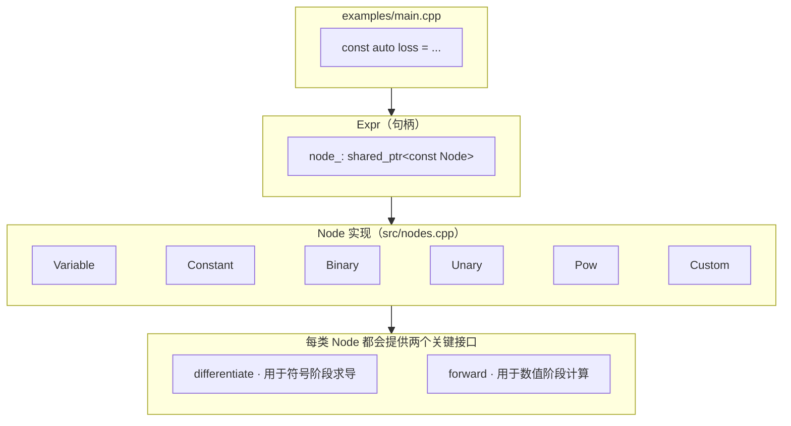

# 静态符号自动求导框架——理解与设计

##### 姓名：王诚昊

##### 邮箱：522025330094@smail.nju.edu.cn 

## 对这个框架的理解

我之前不太了解AD框架和相关方法。下面是在仔细阅读需求，尝试跑了 `examples/main.cpp` 后，对框架的一点个人理解；后文中的设计说明部分是更偏实现与优化的技术展开。

### 框架的目标

目标是实现一个简单的**标量、静态符号自动求导（static symbolic AD）**c++库：先用 `Expr` 把公式建成 **DAG**表达式图，再对指定的 `wrt`（with respect to，即求导目标）做**符号求导**，得到一阶导、二阶导等**新的表达式图**；最后用 **`Evaluator` 在合并后的图上按拓扑顺序做数值前向计算**。求值阶段不再做反向传播或重新求导。

这与 PyTorch “运行时建图”的计算方法不同；这种框架的导数在 `derivative()` 时就已经展开成公式树了。

### 两个阶段

| 阶段 | 做什么 | 主要代码 |
|------|--------|----------|
| **符号阶段** | 建图（包括输入表达式的DAG、对不同wrt的、各阶导数的DAG） | `expr.cpp`、`derivative.cpp`、`nodes.cpp`、`ops.cpp` |
| **数值阶段** | `Evaluator` 编译上一阶段得到的forest，得到可复用的计算方案（类似于编译一个C源代码文件得到一个可执行文件，可执行文件显然可以多次复用） | `evaluator.cpp` |

我的理解，符号阶段用求导规则创建新图（这里的DAG可以**类比一般编译器生成的IR**，也是利用类似语法制导的翻译（**SDT**）这种语义动作方式生成的）；数值阶段只在图上（即基于IR）按顺序做计算。

### 求导如何实现

微积分的链式法则被拆到 **每一种 `Node`** 上：遇到加法、乘法、`pow`、`exp` 等，就在 `Node::differentiate` 里按规则组合子节点的导数，并通过 `differentiate_expr` **递归**向下。

- 入口：`Expr::derivative` → `differentiate_expr(expr, wrt)`（`src/derivative.cpp`）。
- 若当前节点与 `wrt` 是**同一个 `Expr` 对象**（同一 `shared_ptr`），直接返回常数 `1`——这对 `variable("p")` 或子表达式 **`pred`** 作为求导锚点都适用。其实这条规则表达的意思即：
  $$
  \frac{d}{dx}x = 1
  $$
  
- 否则交给具体节点类型，在 `src/nodes.cpp` 里实现；`exp` 等扩展算子在 `ops.cpp` 注册符号梯度，由 `CustomNode` 统一接链式法则。

这样每类节点按照相应的规则（**各种运算的求导规则**）递归地得到新 DAG，类似于编译原理中根据相应规则（**CFG，上下文无关文法**描述）递归地得到AST或者三地址码的过程。

### DAG的存储与复用

- **原函数**（如 `loss`）、**一阶导**（`deriv_p`）、**二阶导**（`deriv_2nd_p`）各是一棵（或以该节点为根的）表达式树，都以 DAG 形式存储。
- 求导会 **新建** 大量节点，但常与原图 **共享** 叶子或中间节点（如 `p`、`x`、`pred` 同一指针）；符号展开里的 `exp` 可能与构图时的 `exp` **不是同一节点**（没做公共子表达式消除，CSE）。
- `Evaluator({loss, deriv_p, ...})` 把各个DAG合成一个forest，共享的node值只算一次，再拓扑排序（DAG的良好性质，保证计算当前值时其依赖值均是已知的）就得到一个计算plan。给定一组输入，在forward计算后就可以得到各个目标值。

## 实现架构

### 总体数据流（这个框架给用户提供的API，以及对应的后端实现）



### 对象关系（谁存什么）



要点：

- **`differentiate` 不会在 `evaluate` 里被调用**；因为DAG的结构（也即“求导”工作）在符号阶段已经完成。
- **`forward` 不会在建图/求导时调用**。
- 多根合并后，**同一 `shared_ptr` 节点只对应一个 slot**，子图里只计算一次。

### 求值顺序（Evaluator里的拓扑排序）

对合并后 DAG 的每个节点排一条序列，保证 **任意节点的所有子节点都排在它前面**（实现为 DFS 后序：`topo_visit` 先子后父）。`evaluate` 严格按 `plan_` 下标递增执行，例如只针对 `loss` 一条链时概念上类似。这样计算当前值时其依赖值一定已经算出：

```text
  slot:  p → x → y → (x*p) → exp → … → pred → (pred-y) → loss
         └── 叶子/常数先算 ──┘ └── 中间节点 ──┘ └ 根 ┘
```

## 符号求导

对每个节点实现 `differentiate(self, wrt)`：

| 算子 | 规则 |
|------|------|
| `c` 常数 | 0 |
| `v` 变量 | `wrt` 与 `v` 为同一 `Expr` 对象时为 1，否则 0 |
| `a+b` | `da+db` |
| `a*b` | `a*db + b*da` |
| `x^n` (n 整数) | `n*x^(n-1)*dx` |
| `abs(x)` | `x/abs(x)*dx`（x=0 处数值可能不稳定，见下文） |
| 自定义 `f` | `Σ (∂f/∂x_i) * dx_i`，由 `SymbolicGradFn` 给出偏导表达式 |

注意“**在对谁求导**”：`wrt` 可以是变量或任意子表达式。如果是同一 `Expr` 实例（`shared_ptr` 相同），则导数为 1；但是如果只是变量或表达式名字相同而实例不同（`shared_ptr` 不一致），则导数为 0。不属于前两种情况则按链式法则递归地向下传播。

## 自定义算子（以 `exp` 为例）

`make_custom_op` 接收：

1. `ForwardFn`：数值前向；
2. `SymbolicGradFn`：在已知 `∂L/∂output`（`grad_outputs`）时，返回每个输入的 `∂L/∂input` 表达式。

`exp` 注册为：

- 前向：`exp(x)`
- 符号梯度：`grad_outputs[0] * exp(x)`（即 `∂L/∂x = ∂L/∂exp * exp(x)`）

`CustomNode::differentiate` 在 `grad_outputs = {1}` 时得到 `∂f/∂x_i`，再乘以 `dx_i/d(wrt)` 并求和，即多元链式法则。

## Evaluator 优化要点

1. **拓扑序**：构造时对全部根 DFS，子节点先于父节点执行。
2. **子图共享**：DAG 中相同 `shared_ptr` 只分配一个 slot，多根（如 `loss` 与 `deriv_p`）共享公共子表达式。
3. **workspace 复用**：`evaluate` 使用 `mutable` 缓冲区，避免每次分配。
4. **常数折叠**：当前 `Constant` 在每次 `evaluate` 写入 slot；可在编译期直接内联到 `forward` 闭包以省一次写入。

## `abs` 在零点的处理

符号导数使用 `x/abs(x)` 作为次梯度。在 `x=0` 求值时可能出现 `0/0`；应用中可避免零点或改为显式 `sign` 节点并在 0 处取 0。

## 项目结构

| 路径 | 职责 |
|------|------|
| `include/ad/expr.hpp` | 用户 API |
| `include/ad/evaluator.hpp` | 求值器 |
| `include/ad/custom_op.hpp` | 自定义算子接口 |
| `include/ad/ops.hpp` | `exp` 等内置扩展 |
| `include/ad/detail/node.hpp` | 内部节点（不对外） |
| `src/*.cpp` | 实现 |

## Build and Run

```bash
cmake -S . -B build
cmake --build build
./build/ad_example
./build/ad_test   # 与中心差分对比一阶、二阶导结果
```
